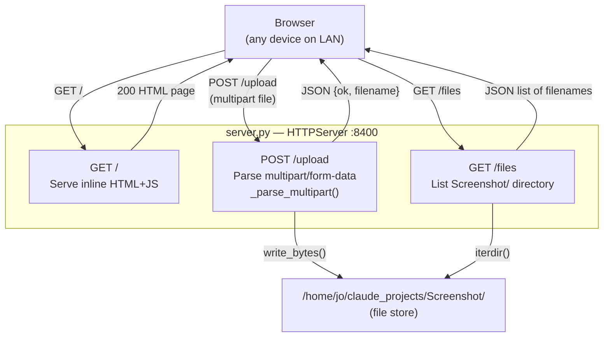

# Architecture

A minimal stdlib-only Python HTTP server (port 8400) that lets any device on the local network drag-and-drop or pick files through a browser UI, saving them to `/home/jo/claude_projects/Screenshot/` on the host machine.

